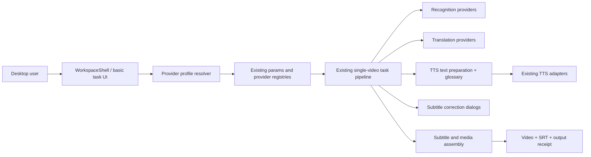
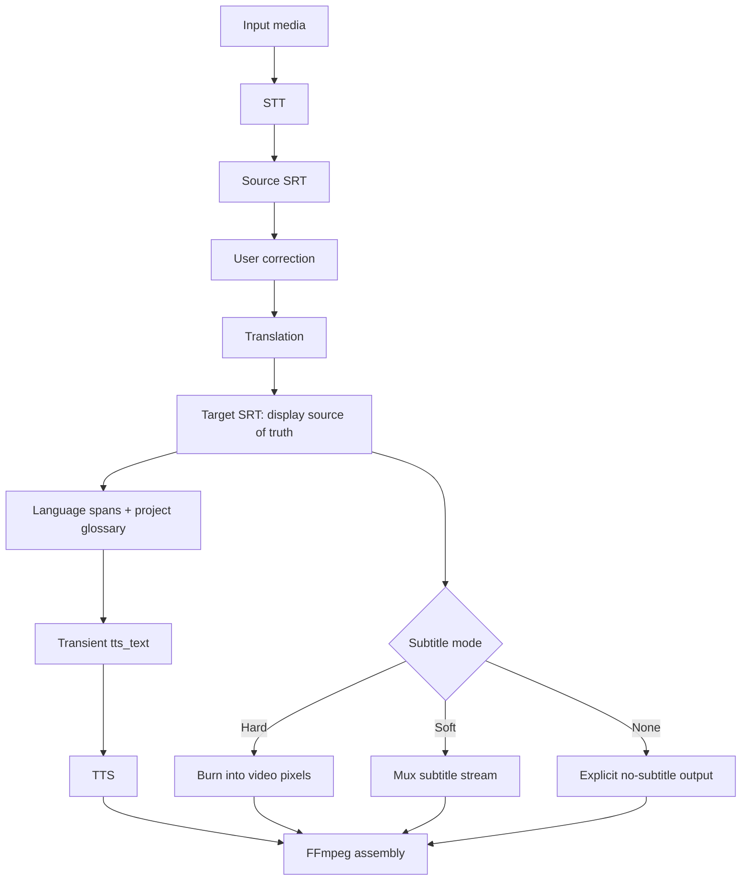

# Architecture — Vietnamese-first workflow extension

## DHSYSTEM organization context

No organization profile is configured. The architecture preserves upstream licensing and project identity metadata.

## System overview

ENH-004 is an incremental layer over the current PySide6 task pipeline. It changes presentation defaults and adds reversible configuration/profile and TTS-text preparation boundaries. It does not replace recognition, translation, TTS or FFmpeg assembly implementations.

## Data flow

## Component decisions

| Component | Decision | Rationale |
| --- | --- | --- |
| Subtitle editor | Repair current `QTableWidget` dialogs | Lowest-risk fix; current data contracts already exist |
| Provider profiles | Mapping layer over current registries/params | Avoids persisted enum breakage and keeps advanced providers reachable |
| TTS pronunciation | Separate `tts_text` preparation service | Protects subtitle fidelity and makes glossary behavior testable |
| VieNeu | External loopback OpenAI-compatible pilot | Avoids dependency conflicts and keeps packaging unchanged during evaluation |
| Subtitle default | Hard subtitle for fresh main workflow | Matches user expectation that captions are immediately visible |
| Provider removal | Deferred until audit/migration task 4.17 | Prevents configuration loss and unsupported assumptions about local models |

## Diagram applicability matrix

| Diagram | Status | Rationale |
| --- | --- | --- |
| system-overview | required | ENH-004 affects UI, profiles and three processing stages |
| data-flow | required | Visible SRT and transient TTS text must remain separate |
| event-flows | optional | Dialog events are sufficiently specified in task 4.13 |
| module-dependencies | optional | Detailed imports belong to implementation design |
| deployment | N/A | No new deployed service; VieNeu pilot is loopback and separately launched |
| user-use-case | N/A | User outcomes are captured in PROJECT-CONTEXT |

## Deployment and runtime

The packaged app remains a Windows onedir PyInstaller application. VieNeu runs as an optional local companion process on loopback during the pilot. Gemini/OpenRouter-compatible profiles are outbound API integrations and must remain optional.

## Open architecture questions

- Exact persisted schema for provider profiles and project glossary.
- Whether code-switch detection should be deterministic-only in Phase 4.16 or optionally LLM-assisted after a privacy review.
- How long English spans must be before dual-voice synthesis is offered.
