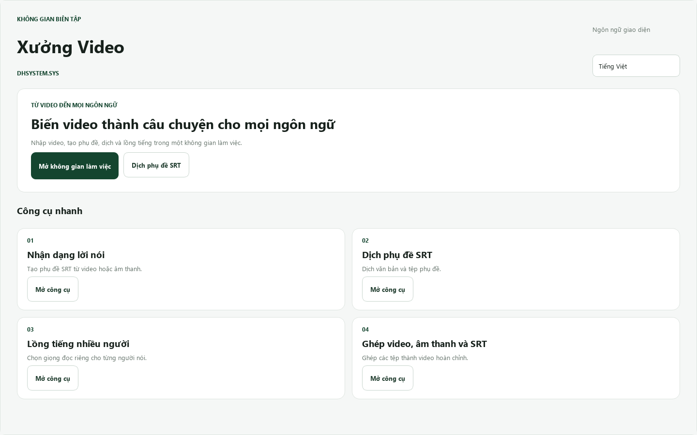
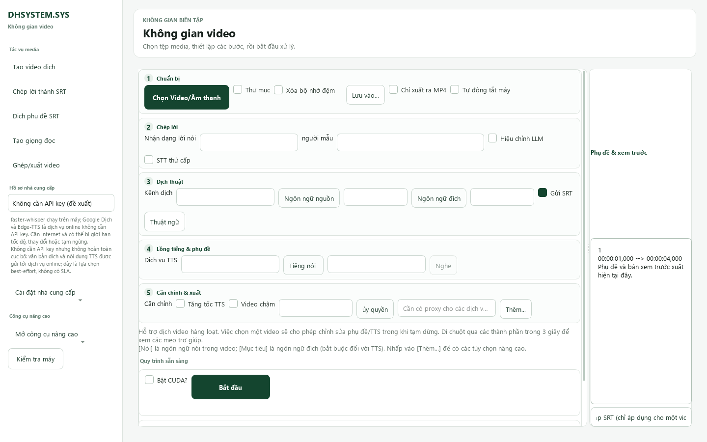
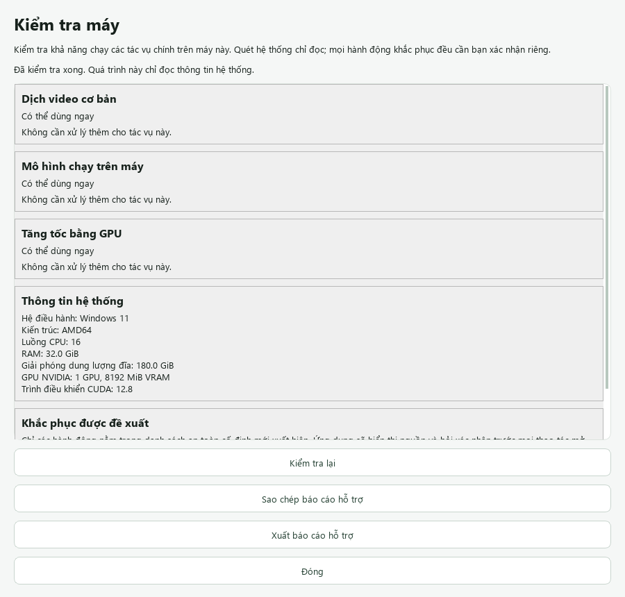

# pyVideoTrans-DH

<div align="center">

**Xưởng dịch video Việt-first: chép lời, dịch phụ đề, lồng tiếng AI và xuất video trong một quy trình.**

[](pyproject.toml)
[](docs/runtime-matrix.md)
[](docs/huong-dan-cai-dat-windows.md)
[](.DHSYSTEM/TRACKER.md)
[](LICENSE)

[Bắt đầu](#bắt-đầu-nhanh) · [Tính năng](#tính-năng-chính) · [CLI](#dòng-lệnh-cli) · [WebUI](#webui) · [Tài liệu](#tài-liệu) · [Trạng thái](#trạng-thái-hiện-tại)

</div>

pyVideoTrans-DH là nhánh phát triển của [pyVideoTrans](https://github.com/jianchang512/pyvideotrans), tập trung vào trải nghiệm desktop tiếng Việt, khả năng đóng gói Windows và quy trình kiểm thử có thể lặp lại. Giao diện ứng dụng chỉ có **Tiếng Việt** và **English**; ngôn ngữ của nội dung video vẫn hỗ trợ tiếng Trung và các ngôn ngữ khác theo provider được chọn.

> **Phiên bản hiện tại:** `4.14`. Bản portable và Setup đã vượt qua kiểm thử local/developer-host, nhưng Setup vẫn **chưa ký số** và cổng xác nhận trên máy Windows sạch vẫn đang mở. Xem [trạng thái chi tiết](#trạng-thái-hiện-tại) trước khi phân phối rộng.

## Giao diện hiện tại

### Trang chủ Xưởng Video



### Không gian làm việc năm bước



<details>
<summary><strong>Kiểm tra khả năng chạy trên máy Windows</strong></summary>



</details>

Các ảnh trên được render trực tiếp từ widget PySide6 hiện tại bằng dữ liệu mẫu đã khử thông tin riêng tư. Có thể tạo lại bằng [script chụp ảnh README](scripts/capture_readme_screenshots.py).

## Tính năng chính

- **Dịch video trọn quy trình:** nhận dạng giọng nói → sửa phụ đề → dịch → lồng tiếng → căn thời gian và xuất video.
- **Không gian làm việc năm bước:** nhóm các điều khiển hiện có theo Chuẩn bị, Chép lời, Dịch thuật, Lồng tiếng & phụ đề, Căn chỉnh & xuất.
- **Phụ đề rõ ràng:** tác vụ mới mặc định dùng phụ đề cứng luôn hiển thị; vẫn có phụ đề mềm, song ngữ và chế độ không phụ đề có xác nhận.
- **Công cụ nhanh:** chép lời thành SRT, dịch SRT, gán giọng cho nhiều người nói và ghép video/âm thanh/phụ đề.
- **Provider linh hoạt:** local, cloud và API tương thích OpenAI; giữ nguyên ID/cấu hình cũ để nâng cấp không làm mất lựa chọn người dùng.
- **Phát âm Việt–Anh không phá dữ liệu:** lớp phát âm chỉ thay chuỗi gửi tới TTS, không sửa SRT hiển thị hoặc file SRT đã lưu.
- **Kiểm tra máy:** đánh giá riêng tác vụ cơ bản, mô hình local và tăng tốc GPU; báo cáo hỗ trợ không chứa khóa API, media hay đường dẫn riêng tư đầy đủ.
- **Ba cách sử dụng:** desktop PySide6, CLI cho tự động hóa và WebUI có kiểm soát truy cập.
- **Phân phối Windows local:** tạo portable ZIP và Setup theo người dùng, không yêu cầu người nhận cài Python, Qt hoặc FFmpeg toàn cục.

## Bắt đầu nhanh

### Dùng bản Windows đã đóng gói

Repository không lưu trực tiếp các gói phát hành nhiều GB. Khi nhận bộ cài từ người duy trì dự án:

1. Đối chiếu file `.sha256` và manifest đi kèm.
2. Với portable ZIP: giải nén toàn bộ, mở thư mục `sp`, chạy `sp.exe`.
3. Với Setup: chạy `pyVideoTrans-DH-<version>-win64-setup.exe` và chọn shortcut nếu cần.
4. Mở **Kiểm tra máy** trước khi tải mô hình lớn hoặc bật CUDA.

Không chạy `sp.exe` ngay bên trong file ZIP. Dữ liệu người dùng nằm ngoài thư mục cài đặt, mặc định tại `%LOCALAPPDATA%\pyVideoTrans`, và được giữ lại khi gỡ ứng dụng. Windows SmartScreen có thể cảnh báo vì bản Setup hiện chưa ký số; chỉ tiếp tục khi checksum đúng và gói đến từ nguồn bạn tin cậy.

Hướng dẫn đầy đủ: [Cài đặt Windows](docs/huong-dan-cai-dat-windows.md).

### Chạy từ mã nguồn

Yêu cầu:

- Python `3.10`–`3.12`; môi trường kiểm chứng gần nhất dùng Python `3.12.14`.
- [uv](https://docs.astral.sh/uv/getting-started/installation/).
- Git, FFmpeg và ffprobe có trong `PATH`.
- Dung lượng trống đủ lớn cho PyTorch và các mô hình AI tùy chọn.

```powershell
git clone https://github.com/danghoangsqtt-sys/dhsys-translator.git
cd dhsys-translator

uv python install 3.12.14
uv sync --python 3.12.14 --locked --group dev
uv run --python 3.12.14 --locked sp.py --lang vi
```

Dùng `--lang en` để mở giao diện tiếng Anh. Lần đồng bộ đầu tiên cần mạng và có thể tải nhiều dependency dung lượng lớn.

## Sử dụng desktop

Luồng cơ bản cho một video:

1. **Chuẩn bị:** chọn video/âm thanh và nơi lưu kết quả.
2. **Chép lời:** chọn ngôn ngữ nguồn, kênh nhận dạng và model. Với lần thử CPU đầu tiên, faster-whisper `tiny` là lựa chọn nhẹ.
3. **Dịch thuật:** chọn ngôn ngữ đích và provider dịch; provider cloud cần mạng/quota/khóa tương ứng.
4. **Lồng tiếng & phụ đề:** chọn dịch vụ TTS, giọng đọc và kiểu phụ đề. Chọn `No` nếu không cần lồng tiếng.
5. **Căn chỉnh & xuất:** kiểm tra tùy chọn thời gian, nhấn **Bắt đầu**, rồi đọc biên nhận đầu ra khi hoàn tất.

Hồ sơ mặc định **Không cần API key (đề xuất)** dùng faster-whisper trên máy, Google Dịch và Edge-TTS. Đây là cách bắt đầu không cần mua/nạp API, nhưng Google Dịch và Edge-TTS vẫn là dịch vụ online best-effort: cần Internet, có thể bị giới hạn tốc độ, thay đổi hoặc tạm ngừng và không có SLA. faster-whisper không tốn phí API nhưng lần đầu phải tải model và dùng tài nguyên máy.

Profile **Cục bộ** chỉ được coi là local-only khi endpoint Local LLM dùng loopback (`localhost`, `127.0.0.1` hoặc `::1`). Gemini/OpenRouter và các API từ xa có thể gửi dữ liệu ra khỏi máy; hãy đọc chính sách của provider trước khi dùng nội dung nhạy cảm.

Hướng dẫn thao tác, phụ đề, VieNeu và xử lý lỗi: [Kiểm thử và sử dụng](docs/huong-dan-test-va-su-dung.md).

## Dòng lệnh CLI

Xem version và các lựa chọn đang có trong chính checkout:

```powershell
uv run --python 3.12.14 --locked cli.py --version
uv run --python 3.12.14 --locked cli.py --list providers
uv run --python 3.12.14 --locked cli.py --list languages
uv run --python 3.12.14 --locked cli.py --list models
```

Ví dụ chép lời video bằng faster-whisper `tiny` trên CPU:

```powershell
uv run --python 3.12.14 --locked cli.py `
  --task stt `
  --name "C:\media\speech.mp4" `
  --recogn_type 0 `
  --model_name tiny `
  --detect_language vi `
  --output-dir "C:\media\results"
```

CLI hỗ trợ bốn tác vụ: `stt` (chép lời), `sts` (dịch phụ đề), `tts` (tạo giọng đọc) và `vtv` (dịch video trọn quy trình). Mỗi lần chạy tạo thư mục kết quả riêng để tránh đè đầu ra của file trùng tên. Xem [toàn bộ tham số CLI](docs/cli.md).

## WebUI

WebUI là giao diện bổ sung và chưa thay thế đầy đủ desktop:

```powershell
uv sync --python 3.12.14 --locked --extra webui
uv run --python 3.12.14 --locked --extra webui webui.py
```

Mở `http://127.0.0.1:7860`. Mặc định WebUI chỉ nghe trên máy cục bộ.

Khi cần truy cập từ mạng nội bộ, phải đặt cả tên người dùng và mật khẩu trước khi bind ra ngoài:

```powershell
$env:PYVIDEOTRANS_WEBUI_USER = 'admin'
$env:PYVIDEOTRANS_WEBUI_PASSWORD = 'thay-bang-mat-khau-dai-rieng'
uv run --python 3.12.14 --locked --extra webui webui.py --host 0.0.0.0 --port 7860
```

Không commit mật khẩu. Nếu đưa WebUI ra Internet, đặt HTTPS ở reverse proxy hoặc một kênh bảo mật tương đương. Xem [hướng dẫn WebUI](docs/webui.md).

## Provider và mô hình

Giao diện mặc định chỉ hiện nhóm provider phổ biến cho Việt Nam/quốc tế. Các tích hợp Trung Quốc hoặc ít dùng hơn **không bị xóa**: bật **Hiện tất cả nhà cung cấp** trong một trong ba menu Cài đặt dịch/nhận dạng/lồng tiếng để khôi phục toàn bộ 29 kênh dịch, 33 kênh nhận dạng và 38 kênh TTS. Lựa chọn cũ nằm ngoài danh sách rút gọn vẫn được giữ nguyên và luôn hiện khi đang được chọn.

| Nhóm | Ví dụ được tích hợp | Ghi chú |
| --- | --- | --- |
| Nhận dạng | faster-whisper, Whisper/OpenAI, WhisperX, Qwen, Deepgram, Azure, Google | Local và cloud; model lớn cần thêm tài nguyên. |
| Dịch | Google, Microsoft, DeepSeek, Gemini, OpenRouter, Claude/OpenAI-compatible, Ollama/Local LLM | Chất lượng, quota và chính sách dữ liệu phụ thuộc provider. |
| Giọng đọc | Edge TTS, OpenAI-compatible, Azure, ElevenLabs, F5-TTS, GPT-SoVITS, VieNeu pilot | Một số kênh cần server/model chạy riêng hoặc khóa API. |
| Công cụ media | FFmpeg/ffprobe, tách giọng, ghép audio/video/SRT, căn phụ đề | FFmpeg được bundle trong bản Windows. |

Ý nghĩa nhãn và chi phí:

| Nhãn/loại | Dùng ngay? | Chi phí thực tế |
| --- | --- | --- |
| `local · cần tải model` | Chưa chắc; ứng dụng có adapter nhưng model có thể chưa tải | Không có phí API nhà cung cấp; tốn dung lượng đĩa và tài nguyên CPU/GPU/RAM, đồng thời phải tuân thủ giấy phép model. |
| Online, không cần API key | Cần Internet | Không cần mua khóa API, nhưng dịch vụ có thể rate-limit/thay đổi/ngừng và không có SLA. |
| API nhà cung cấp | Cần tài khoản, khóa và cấu hình | Có thể có trial/free tier, nhưng quota thay đổi và phần vượt mức có thể tính phí. |
| Local API/server | Cần tự cài, tải model và chạy server riêng | Không có phí API khi endpoint thực sự chạy trên máy; vẫn có chi phí phần cứng/điện/vận hành. |
| Endpoint tùy chỉnh | Phụ thuộc server được nhập | Khóa, chi phí và việc dữ liệu có rời máy hay không do endpoint đó quyết định. |

Danh sách có thể thay đổi theo code và cấu hình. Dùng `cli.py --list providers` hoặc bật **Hiện tất cả nhà cung cấp** để xem dữ liệu chính xác của bản đang chạy. Không có API key, model có giấy phép chưa xác minh hay dữ liệu người dùng nào được bundle vào gói phân phối.

## Trạng thái hiện tại

Kiểm chứng gần nhất ngày **07/10/2026**:

| Hạng mục | Trạng thái |
| --- | --- |
| Bộ test nguồn | **726 passed**, 1 cảnh báo ngoài dự án từ `pydub/audioop`, Python 3.12.14 |
| Giao diện | Việt/Anh, 5 bước, trang chủ, công cụ nhanh, Kiểm tra máy |
| Windows portable/Setup | Build và xác minh local đạt; portable chạy không cần Python trên `PATH` |
| Vòng đời cài đặt | Cài, mở hai lần, nâng cấp cùng version, gỡ và giữ dữ liệu người dùng đạt trên developer-host |
| Media đóng gói | STT → dịch → TTS → MP4; phụ đề cứng/mềm đã có bằng chứng local |
| Cổng còn mở | Windows Sandbox/VM/người dùng sạch; shortcut/SmartScreen; ký số Setup |

Vì các cổng trên còn mở, repository **không tuyên bố bản 4.14 là release Windows công khai hoàn tất**. Theo dõi bằng chứng và việc đang làm tại [.DHSYSTEM/TRACKER.md](.DHSYSTEM/TRACKER.md).

## Kiểm thử và phát triển

Chạy toàn bộ suite trong PowerShell:

```powershell
$env:QT_QPA_PLATFORM = 'offscreen'
uv run --python 3.12.14 --locked --group dev pytest -q -p no:cacheprovider `
  --basetemp="$env:TEMP\pyvideotrans-pytest"
```

Tạo lại ảnh README:

```powershell
.\.venv\Scripts\python.exe scripts\capture_readme_screenshots.py
```

Script dùng Qt offscreen, nạp Segoe UI từ Windows và chỉ render dữ liệu mẫu. Hãy xem lại cả ba PNG trước khi commit.

## Tài liệu

- [Mục lục tài liệu](docs/README.md)
- [Hướng dẫn cài đặt Windows](docs/huong-dan-cai-dat-windows.md)
- [Hướng dẫn kiểm thử và sử dụng](docs/huong-dan-test-va-su-dung.md)
- [Thiết lập môi trường phát triển](docs/dev-setup.md)
- [Kiến trúc kỹ thuật](docs/architecture.md)
- [Ma trận runtime](docs/runtime-matrix.md)
- [CLI](docs/cli.md) · [WebUI](docs/webui.md) · [FAQ](docs/faq.md)

## Dữ liệu, bảo mật và trách nhiệm sử dụng

- Cấu hình, cache và log của bản Windows nằm trong vùng dữ liệu người dùng, không ghi vào thư mục cài đặt chỉ đọc.
- Báo cáo **Kiểm tra máy** được thiết kế để loại khóa API, nội dung media và đường dẫn riêng tư đầy đủ.
- Thao tác khắc phục hệ thống chỉ dùng action nằm trong allowlist và luôn yêu cầu xác nhận; ứng dụng không âm thầm cài driver GPU, CUDA hay model lớn.
- Người dùng chịu trách nhiệm về bản quyền nội dung, điều khoản provider, chi phí/quota API và quy định pháp luật tại nơi sử dụng.

## Nguồn gốc và giấy phép

Dự án này phát triển từ [jianchang512/pyvideotrans](https://github.com/jianchang512/pyvideotrans) và tiếp tục sử dụng nhiều dự án nguồn mở như [FFmpeg](https://github.com/FFmpeg/FFmpeg), [PySide6](https://pypi.org/project/PySide6/), [faster-whisper](https://github.com/SYSTRAN/faster-whisper), [edge-tts](https://github.com/rany2/edge-tts) và [Gradio](https://www.gradio.app/).

Mã nguồn được phân phối theo [GNU General Public License v3.0](LICENSE). Bản quyền và giấy phép của dependency/model đi kèm vẫn thuộc về các tác giả tương ứng.
